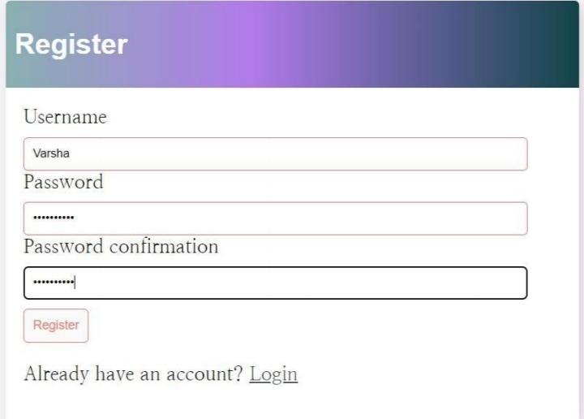

# Django To-Do List with User Authentication

This is a To-Do list application built with Django that includes user registration, login, search functionality, and full CRUD operations (Create, Read, Update, Delete) for tasks.

## Features

- User Registration: Users can create an account to access the To-Do list app.
- User Login: Existing users can log in to their accounts.
- Create Task: Users can add new tasks to their list.
- Read Task: Users can view their list of tasks.
- Update Task: Users can edit the details of a task.
- Delete Task: Users can remove a task from their list.
- Task Search: Users can search for specific tasks based on title or description.

## Installation

1. Clone the repository:

     bash
    git clone https://github.com/your-username/django-todo-list.git
    
2. Change into the project directory:

    bash
    cd django-todo-list
3. Create a virtual environment:

    bash
    python3 -m venv venv
 4. Activate the virtual environment:

    On macOS and Linux:
      bash  
      source venv/bin/activate
      
    On Windows:
      bash
      venv\Scripts\activate
5. Install the required dependencies:

    bash
    pip install -r requirements.txt
6. Set up the database:

    bash
    python manage.py migrate
7. Start the development server:

    bash
    python manage.py runserver
8. Open your browser and navigate to http://localhost:8000 to access the To-Do list app.

Usage
- Register a new account by clicking on the "Sign Up" link and providing the required information.
- Log in with your credentials using the "Log In" link.
- Add new tasks by clicking on the "Add Task" button and filling out the task details.
- View your tasks on the homepage, where you can see the task title, description, due date, and completion status.
- Edit a task by clicking on the task title and updating the information.
- Delete a task by clicking on the task title and selecting the "Delete" option.
- Search for specific tasks by entering keywords in the search bar.
Contributing
- Contributions are welcome! If you find any issues or have suggestions for improvement, please open an issue or submit a pull request.
